# Workflow Penelitian

Langkah-langkah dalam Network Pharmacology:
* Pencarian data target gen dengan OMIM
*	Setelah data dibersihkan, ambil data “Approved Symbol”-nya
*	Mencari senyawa potensial yang bisa berinteraksi dengan gen target penyakit dengan PubChem
*	Ambil SMILE-nya di PubChem
*	Ambil “Common Name”-nya di SwissTargetPrediction
*	Gabungkan semua Common Name/Target di Excel dan hapus setiap duplikat, beri nama sheet “All Target”
*	Gabungkan setiap target dan tulis senyawanya
*	Gabungkan Approved Symbol dan Common Name di Excel dan buat juga irisan Approved Symbol dan Common Name di Venny, setelah itu masukkan ke Excel
*	Masukkan file gabungan maupun irisan ke STRING-DB dan download visualisasinya untuk dianalisis di Cytoscape
*	Lakukan clustering dengan CytoCluster dan ranking node dengan CytoHubba
*	Melakukan enrichment analysis dengan ShinyGO menggunakan data dari top 20 union degree dan mendownload biological process, molecular function, KEGG pathways, dan all enrich terms
*	Memvisualisasikan network senyawa-target dengan Cytoscape
*	Merge (menggabungkan) network senyawa-target, irisan penyakit-senyawa, dan hasil enrichment KEGG
*	Membuat visualisasi dari hasil Merge

Langkah-langkah dalam Molecular Docking:
* Dari ranking tertinggi string_interaction_irisan.tsv, didapatkan protein target/reseptor yang paling signifikan adalah mTOR
*	Dari semua identifier mTOR, saya memilih 4JSX sebagai protein yang paling cocok untuk dilakukan molecular docking
*	Di SwissDock persiapkan ligan (Ergosterol Peroxide), 4JSX sebagai protein target, dan posisi ligan di protein yang sudah didapatkan di PrankWeb
*	Mulai lakukan Docking

# Hasil Network Pharmacology
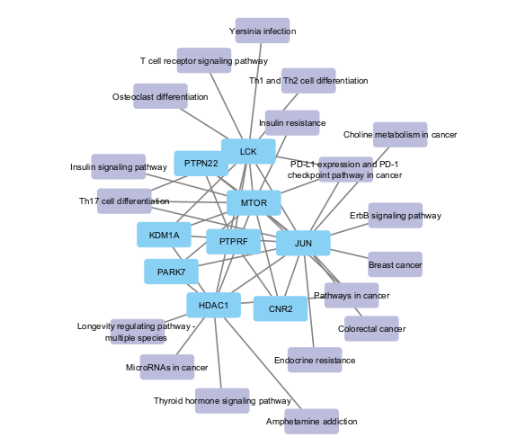
# Hasil Molecular Docking
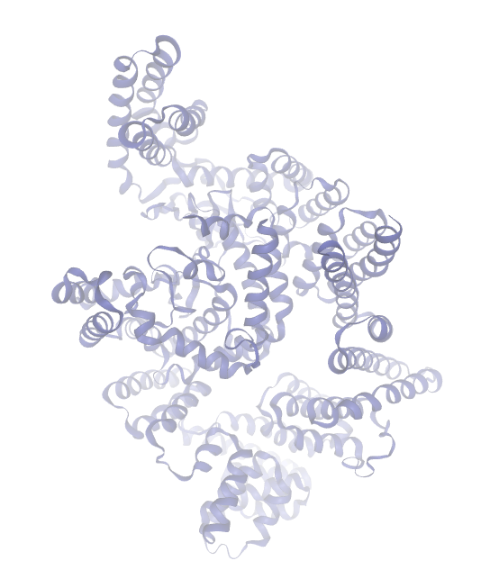
# Laporan Singkat
## Pendahuluan
Kita akan meneliti apakah senyawa yang terdapat pada jamur Chaga serta beberapa komponen tumbuhan lain dapat berinteraksi dengan sel kanker kolorektal.
## Metode
Langkah pertama kita mencari gen kanker kolorektal di website OMIM. Setelah mendapat datanya, kita ambil data approved symbolnya, lalu kita bersihkan dengan “Remove Duplicate”. Dengan bantuan literatur, kita mengambil senyawa-senyawa yang diduga dapat berinteraksi dengan gen kanker kolorektal. Pada studi ini kita mengambil senyawa dari jamur Chaga dan juga dari senyawa-senyawa lain.

Kita kemudian ke PubChem dan mengambil data SMILE dari senyawa-senyawa obat tersebut. Masukkan data SMILE ke Swiss Target Prediction dan ambil “common name” dari file-file Excel tersebut. Buat sheet excel sendiri untuk tiap-tiap senyawa dan hapus kolom yang tertulis N/A. Buat sheet excel sendiri yang merupakan gabungan dari keenam senyawa obat, jangan lupa hapus duplikat. Buat juga excel sendiri yang bertuliskan nama dan termasuk dalam senyawa apa target-target tersebut.

Buat di file excel baru satu sheet yang berisi semua senyawa penyakit dan juga semua senyawa obat yang bersebelahan. Kemudian buat irisan dari kedua data tersebut menggunakan website Venny, dan juga buat gabungan antara senyawa penyakit dan obat.

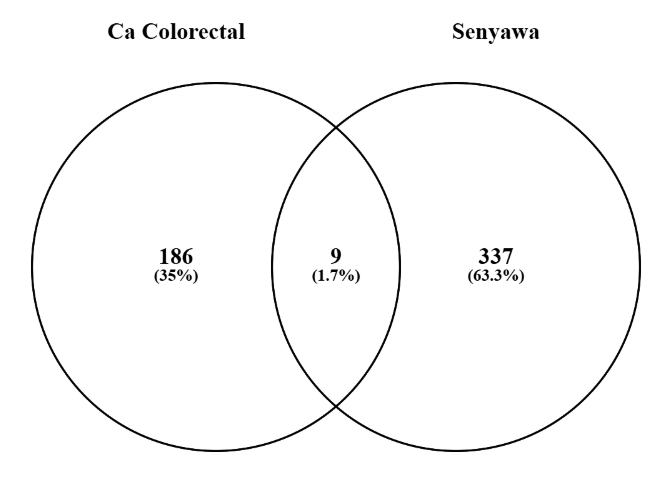
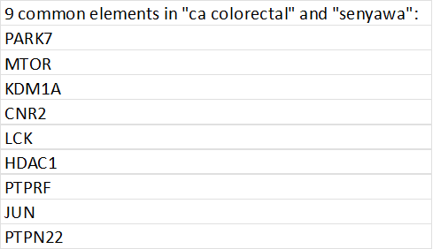

Masukkan hasil irisan dari data penyakit dan data obat ke website String untuk kemudian mendapat visualisasi protein-protein interaction irisan dari penyakit dan obat. Setelah irisan, buat gabungan dari senyawa penyakit dan obat dalam satu column, lalu masukkan ke String untuk mendapat visualisasi protein-protein interaction gabungan. Jadi sekarang kita mempunyai dua file, irisan dan gabungan dari senyawa penyakit dan obat.

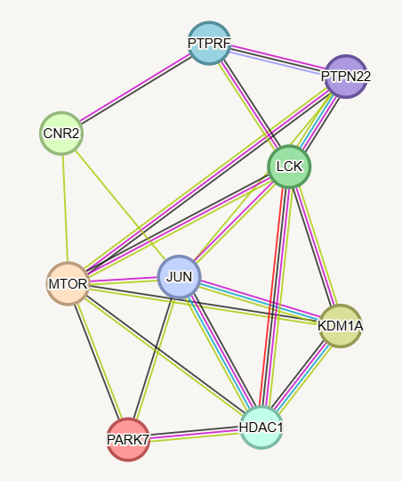*Irisan String*

Langkah berikutnya adalah visualisasi data menggunakan aplikasi Cytoscape. Masukkan file gabungan data dan kita dapat melihat data gabungan yang masif. Kemudian lakukan analyze network untuk melihat data-data dari senyawa gabungan tersebut seperti degree, betweenness centrality, dan closeness centrality.

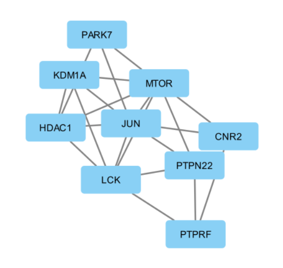*Irisan Cytoscape*

Kemudian aktifkan cytocluster dan gunakan untuk membuat cluster-cluster. Dalam studi ini terbentuk 13 cluster. Kita lalu membuat network dari cluster pertama. Network itu lalu kita analisis seperti biasa. Kita kemudian menghapus data-data analisis yang tidak kita butuhkan, dan sisakan degree, betweenness centrality, dan closeness centrality karena hanya data itu yang kita butuhkan.

Kita lalu ubah bentuk network menjadi lingkaran berdasarkan degree. Setelah disimpan, kita kembali ke main network. Dengan cytohubba kita ambil 20 data terpenting dari network tersebut. Rangking tertinggi pada network ini adalah EGFR. Kita kemudian membuka file irisan dan terdapat 9 nodes. Dengan Cytohubba didapatkan kalau node tertinggi adalah MTOR.

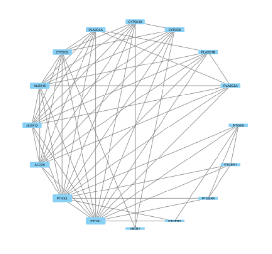*Tabel Hub Protein*

Kita kemudian melakukan enrichment analysis dengan ShinyGO. Top 20 senyawa yang kita dapatkan tadi kita masukkan ke dalam ShinyGO. Dari 20 senyawa tersebut yang menduduki posisi paling berpengaruh adalah “Prolactin Signaling Pathway”.

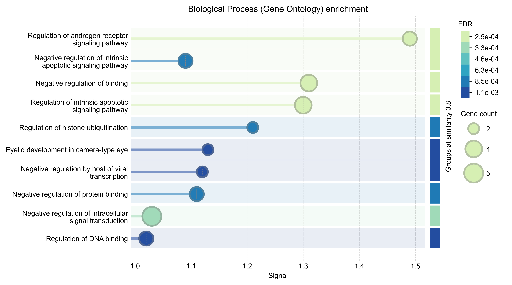*Enrichment Analysis*

Kita lalu kembali ke String dan memasukkan 9 protein irisan yang tadi. Dari hasil analisis, kita akan mendownload biological process (gene ontology), molecular function (gene ontology), KEGG pathways, dan All Enriched Terms untuk kemudian divisualisasikan di Cytoscape. Kita buka file Enrichment KEGG dan mendapatkan 18 pathways. Kita kemudian membuka file target-senyawa dan jangan lupa mengubah tanda di senyawa menjadi source node. Dan inilah network target-senyawa yang kita miliki. Kita juga membuka file string_interaction_irisan yang kita dapat di awal. Dan terakhir kita membuka file Enrichment KEGG yang berisi 18 pathways. Kita kemudian me-“merge” (menggabungkan) ketiga file tersebut dan inilah network yang kita miliki.

Kita kemudian pilih nodes connected by selected edges. Selanjutnya kita memilih first neighborhood of selected nodes dan klik undirected. Kita lanjutkan dengan memilih new network dan from selected nodes, all edges. Dan inilah network pharmacology yang kita punya. 
Molecular docking dilakukan untuk mengevaluasi potensi interaksi antara **ergosterol peroxide (EP)** sebagai ligan dan **mammalian target of rapamycin (mTOR)** sebagai protein target. mTOR merupakan protein serine/threonine kinase yang berperan penting dalam regulasi pertumbuhan, proliferasi, metabolisme, dan kelangsungan hidup sel. Karena aktivitas jalur mTOR berkaitan erat dengan pertumbuhan sel, protein ini merupakan salah satu target molekuler yang relevan dalam penelitian kanker. UniProt mengidentifikasi protein mTOR manusia dengan accession **P42345 (MTOR_HUMAN)** dan panjang 2.549 asam amino.

Struktur tiga dimensi mTOR yang digunakan dalam analisis ini diperoleh dari Protein Data Bank dengan kode **PDB ID 4JSX**. Struktur tersebut merupakan kompleks **mTORΔN–mLST8–Torin2** yang ditentukan menggunakan X-ray crystallography dengan resolusi **3,50 Å** dan tidak mengandung mutasi pada mTOR. Struktur 4JSX sangat sesuai untuk analisis docking karena mengandung ligan yang dikristalkan bersama protein, yaitu **Torin2**, yang pada PDB diberi kode heteroatom **17G**. Torin2 merupakan inhibitor mTOR yang menempati *ATP-binding pocket* pada kinase domain, sehingga lokasi ligan tersebut dapat digunakan sebagai referensi untuk menentukan daerah docking.

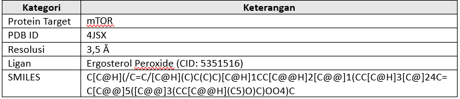*Tabel*

Sebelum docking dilakukan, prediksi *binding pocket* juga dianalisis menggunakan **P2Rank/PrankWeb**. Pocket dengan peringkat pertama memiliki **P2Rank score 9,57**, probability **0,556**, dan terdiri atas **18 residu**. Probability pada PrankWeb merupakan transformasi skor P2Rank ke skala 0–1 yang dikalibrasi berdasarkan proporsi *true binding sites* pada situs dengan skor sebanding. Dengan demikian, nilai tersebut sebaiknya dipahami sebagai tingkat keyakinan prediksi pocket, bukan sebagai probabilitas bahwa ergosterol peroxide akan mengikat mTOR. Menariknya, lokasi pocket yang diprediksi P2Rank bertepatan dengan daerah tempat Torin2 berada pada struktur kristal, sehingga memberikan dasar tambahan untuk memilih daerah tersebut sebagai *search space* docking.

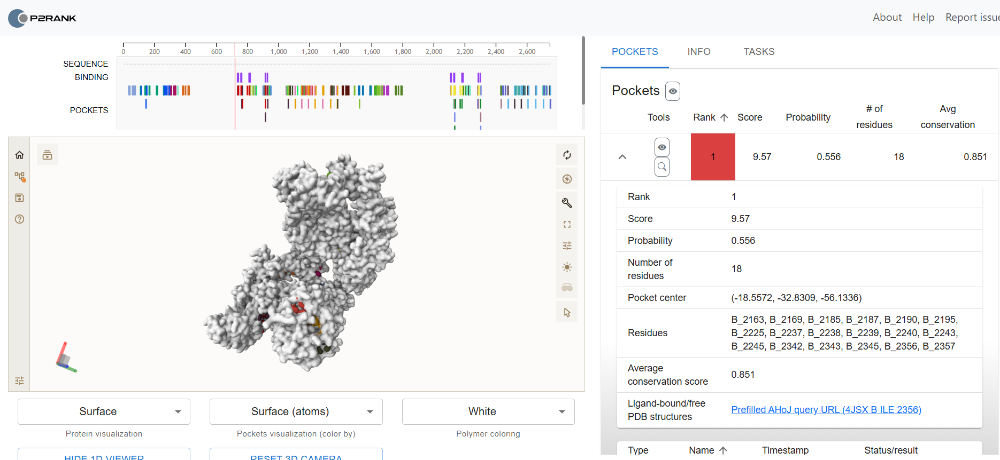*Prankweb*

Pada proses docking menggunakan SwissDock dengan metode **AutoDock Vina**, ergosterol peroxide ditempatkan pada pocket mTOR yang mengacu pada posisi Torin2. Berdasarkan file hasil docking, *search box* berukuran **25 × 25 × 25 Å** dengan pusat pada koordinat sekitar **X = 49, Y = −1, dan Z = −48 Å**. Torin2 dikeluarkan dari receptor sebelum docking sehingga ergosterol peroxide dapat mengeksplorasi ruang ikatan yang sebelumnya ditempati ligan tersebut.

*Visualisasi*

Docking menghasilkan 20 model atau pose dengan *calculated affinity* antara **−8,779 hingga −6,257 kcal/mol**. Model 1 memberikan nilai paling rendah, yaitu **−8,779 kcal/mol**, diikuti Model 2 sebesar −8,484 kcal/mol dan Model 3 sebesar −8,384 kcal/mol. Karena fungsi scoring Vina memberikan nilai yang lebih favorable pada energi yang lebih negatif, **Model 1 dipilih sebagai pose terbaik berdasarkan scoring docking**. Analisis file koordinat Model 1 juga menunjukkan bahwa EP berada dekat dengan sejumlah residu mTOR, antara lain **Ile2163, Leu2185, Lys2187, Tyr2225, Ile2237, Gly2238, Trp2239, Val2240, Met2345, Ile2356, dan Asp2357**. Beberapa residu tersebut juga termasuk dalam pocket yang diprediksi oleh P2Rank, sehingga mendukung bahwa pose terbaik tidak sekadar berada di permukaan protein, tetapi menempati daerah pocket yang ditargetkan.

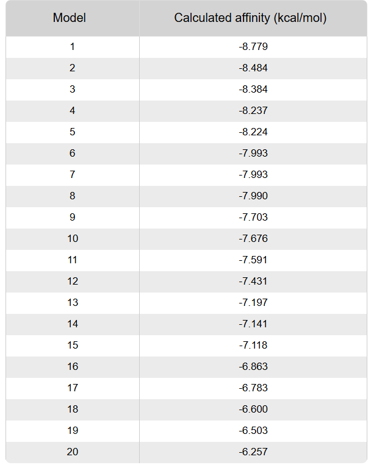*Affinity Binding*

Hasil ini menunjukkan bahwa ergosterol peroxide mempunyai **interaksi yang energetically favorable secara komputasional** dengan pocket kinase mTOR. Nilai −8,779 kcal/mol dapat digunakan sebagai *predicted binding affinity*, tetapi tidak dapat secara langsung dianggap sebagai bukti bahwa EP benar-benar mengikat atau menghambat mTOR pada sistem biologis. Docking merupakan metode prediktif dan dipengaruhi oleh struktur protein, protonasi, fleksibilitas receptor, ukuran *search space*, serta fungsi scoring yang digunakan.

Untuk memperkuat validitas hasil, tahap selanjutnya yang penting adalah melakukan **redocking Torin2** menggunakan kondisi docking yang sama. Karena Torin2 merupakan *co-crystallized ligand* 4JSX, pose hasil redocking dapat dibandingkan dengan posisi Torin2 pada struktur kristal menggunakan RMSD. Selain itu, *binding affinity* EP sebesar **−8,779 kcal/mol** dapat dibandingkan langsung dengan Torin2. Dengan validasi tersebut, hasil docking ini dapat memberikan dasar yang lebih kuat untuk mengajukan hipotesis bahwa **mTOR merupakan salah satu potential molecular targets ergosterol peroxide**, yang selanjutnya perlu dikonfirmasi melalui pendekatan eksperimental.
